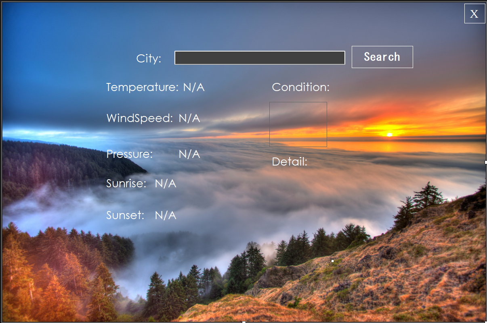

# Weather Application based on C#

- This desktop application provides weather information of a specific city making an API call to openweathermap.org
- The application is based on windows form using C#
- Put the api-key in the form1.cs file before running the application

